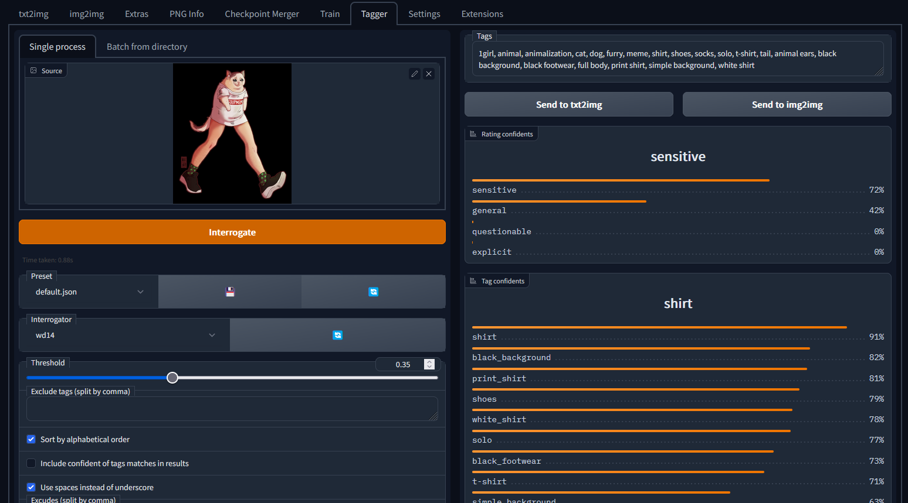

# Tagger for [Automatic1111's WebUI](https://github.com/AUTOMATIC1111/stable-diffusion-webui)

Interrogate booru style tags for single or multiple image files using various models, such as DeepDanbooru.

**This branch is a fork of [WD14Tagger](https://github.com/toriato/stable-diffusion-webui-wd14-tagger) maintained by
@Akegarasu**

see also: https://github.com/picobyte/stable-diffusion-webui-wd14-tagger

## Installation

1. *Extensions* -> *Install from URL* -> Enter URL of this repository -> Press *Install* button
    - or clone this repository under `extensions/`
       ```sh
       $ git clone https://github.com/Akegarasu/stable-diffusion-webui-wd14-tagger.git extensions/tagger
       ```

2. *(optional)* Add interrogate model
    - #### [*Waifu Diffusion 1.4 Tagger by MrSmilingWolf*](docs/what-is-wd14-tagger.md)
      Downloads automatically from the [HuggingFace repository](https://huggingface.co/SmilingWolf/wd-v1-4-vit-tagger)
      the first time you run it.


3. Start or restart the WebUI.
    - or you can press refresh button after *Interrogator* dropdown box.
    - "You must close stable diffusion completely after installation and re-run it!"

## Model comparison

[Model comparison](docs/model-comparison.md)

## Screenshot



Artwork made by [hecattaart](https://vk.com/hecattaart?w=wall-89063929_3767)

## Copyright

Public domain, except borrowed parts (e.g. `dbimutils.py`)
